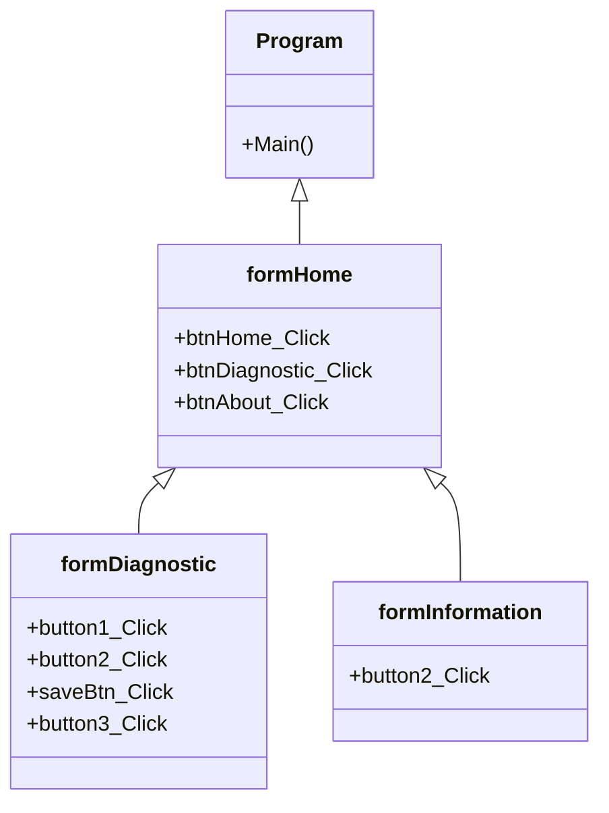

# Final_Project001
ความเป็นมาของโปรแกรม
```
แนวคิดการสร้างโปรแกรมนี้ขึ้นมาเพื่อให้ง่ายต่อการตรวจว่าตนเป็นโรคหัวใจหรือไม่ เพราะโรงพยาบาลส่วนมากคิวก็อาจจะเต็ม จนไม่สามารถเข้ารับการตรวจได้จึงสร้างโปรแกรมนี้มาเพื่อที่คนภายนอกจะสามารถทำการพยากรณ์โรคหัวใจได้ และสามารถบันทึกข้อมูลของตัวเองได้และโปรแกรมนี้สามารถใช้ได้ทั้งบุคคลภายนอกและภายใน
```
วัตถุประสงค์ของโปรแกรม
```
วัตถุประสงค์ของโปรแกรมนี้สร้างขึ้นเพื่อที่จะพยากรณ์โรคหัวใจและทำการบันทึกข้อมูลส่งให้กับทางแพทย์ได้

```
Class Diagram

ชื่อผู้พัฒนาโปรแกรม
```653450095-6 นายพิชชากร สกุลไทย```
